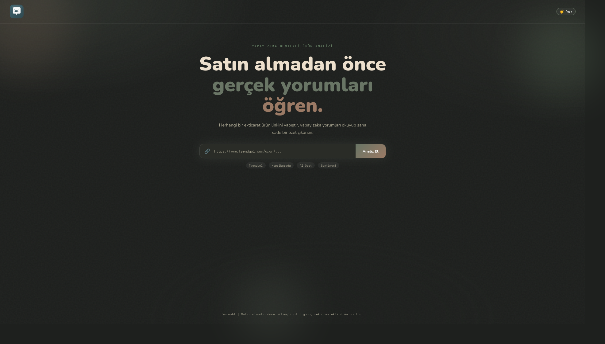

<div align="center">

# 🛍️ Sentiment Analysis Service

**Trendyol & Hepsiburada Ürün Yorum Analiz Servisi**

[](https://www.python.org/)
[](https://djangoproject.com/)
[](https://docs.celeryq.dev/)
[](https://docs.docker.com/compose/)
[](https://selenium.dev/)
[](https://ai.google.dev/)
[](https://fastmcp.com/)
[](LICENSE)

**Trendyol ve Hepsiburada ürün sayfalarından yorumları otomatik çekip, LLM ile duygu analizi yapan ve Claude Desktop / Claude Code entegrasyonu sunan tam kapsamlı bir analiz servisidir.**

[🚀 Hızlı Başlangıç](#-hızlı-başlangıç) • [💡 Özellikler](#-özellikler) • [🏗️ Mimari](#️-mimari) • [🤖 Claude Entegrasyonu](#-claude-entegrasyonu) • [📡 API](#-api-kullanımı)



</div>

---

## 💡 Özellikler

<table>
<tr>
<td width="50%">

### 🕷️ Veri Toplama
- **Selenium ile Otomatik Scraping**: Trendyol ve Hepsiburada destekli
- **Yüzlerce Yorum**: İstek başına 100–3000 yorum arası
- **Akıllı Filtreleme**: Bot yorumu tespiti, duplicate analizi
- **Bilgi Değeri Skoru**: Sadece anlamlı yorumlar LLM'e gönderilir

</td>
<td width="50%">

### 🤖 LLM Analizi
- **Gemini 2.5 Flash/Pro** desteği (Google AI & Vertex Express)
- **Ollama** ile yerel LLM fallback
- **Keyword tabanlı** deterministik fallback (API gerekmez)
- **Toplu sınıflandırma**: Negatif / Nötr / Pozitif

</td>
</tr>
<tr>
<td width="50%">

### 📊 Raporlama
- **Türkçe Özet Rapor**: Şikayet ve memnuniyet temaları
- **Bot Şüphesi Tespiti**: Tekrar eden yorum paterni analizi
- **Satın Alma Önerisi**: LLM destekli karar özeti
- **Dağılım İstatistikleri**: Neg/Nötr/Poz oranları

</td>
<td width="50%">

### 🔌 Claude Entegrasyonu
- **MCP Server** (FastMCP): Claude Desktop & Claude Code
- **`analyze_product(url)`**: URL ver, özet rapor al
- **`check_analysis(id)`**: Analiz durumunu sorgula
- **Async polling**: Uzun analizler için otomatik takip

</td>
</tr>
</table>

---

## 🏗️ Mimari

```
┌─────────────────────────────────────────────────────────────────────┐
│                         DOCKER COMPOSE                              │
│                                                                     │
│  ┌──────────┐    ┌──────────┐    ┌──────────┐    ┌──────────────┐  │
│  │  Claude  │    │   Web    │    │  Worker  │    │    Chrome    │  │
│  │ Desktop/ │───▶│ Django + │───▶│  Celery  │───▶│  Selenium   │  │
│  │ Claude   │    │ Gunicorn │    │          │    │  Standalone  │  │
│  │  Code    │    │ :8000    │    │          │    │   :4444      │  │
│  └─────┬────┘    └──────────┘    └──────┬───┘    └──────────────┘  │
│        │                                │                          │
│  ┌─────▼────┐    ┌──────────┐    ┌──────▼───┐                      │
│  │   MCP    │    │   Redis  │    │ Gemini / │                      │
│  │  Server  │    │  :6379   │    │ Vertex / │                      │
│  │  :8001   │    │ (Broker) │    │  Ollama  │                      │
│  └──────────┘    └──────────┘    └──────────┘                      │
│                                                                     │
│                  ┌──────────────────────────┐                       │
│                  │   PostgreSQL :5432        │                       │
│                  └──────────────────────────┘                       │
└─────────────────────────────────────────────────────────────────────┘
```

### Analiz Pipeline'ı

```
URL (Trendyol / Hepsiburada)
    │
    ▼
[1] Scraping (Selenium Chrome)
    Yorum metinleri çekilir (100-3000 arası)
    │
    ▼
[2] Filtreleme & Hazırlık
    • Çok kısa / anlamsız yorumlar çıkarılır
    • Normalize edilip duplicate sayılır
    │
    ▼
[3] Shortlist Seçimi (Bilgi Değeri Skoru)
    • Her yoruma bilgi değeri skoru hesaplanır
    • En anlamlı N yorum LLM'e gönderilir
    │
    ▼
[4] Sentiment Sınıflandırma (LLM)
    Negatif / Nötr / Pozitif
    Öncelik: Gemini → Vertex → Ollama → Keyword Fallback
    │
    ▼
[5] Özet Rapor Üretimi (LLM)
    • Şikayet temaları
    • Memnuniyet temaları
    • Bot şüphesi analizi
    • Satın alma önerisi
```

---

## 🚀 Hızlı Başlangıç

### Gereksinimler

- [Docker](https://docs.docker.com/get-docker/)
- [Docker Compose v2](https://docs.docker.com/compose/install/)

### 1. Kurulum

```bash
# Repository'i klonla
git clone <repo-url>
cd sentiment

# Ortam dosyasını oluştur
cp .env.example .env

# .env dosyasını düzenle (en azından GEMINI_API_KEY ekle)
nano .env
```

### 2. Servisleri Başlat

```bash
# İlk kurulumda (image build eder)
docker compose up --build

# Sonraki başlatmalarda
docker compose up -d
```

### 3. Hazır!

| Servis | URL |
|--------|-----|
| Web Arayüzü | http://localhost:8000/ |
| API | http://localhost:8000/api/ |
| MCP Server | http://localhost:8001/mcp |

---

## ⚙️ Ortam Değişkenleri

`.env.example` dosyasını baz alarak `.env` oluştur:

```bash
# Django
DJANGO_SECRET_KEY=gizli-anahtar-buraya
DJANGO_DEBUG=False
DJANGO_ALLOWED_HOSTS=localhost,127.0.0.1,web

# PostgreSQL
POSTGRES_DB=sentiment
POSTGRES_USER=sentiment
POSTGRES_PASSWORD=guclu-sifre

# Redis
CELERY_BROKER_URL=redis://redis:6379/0
CELERY_RESULT_BACKEND=redis://redis:6379/1

# Selenium
SELENIUM_REMOTE_URL=http://chrome:4444/wd/hub

# ─── LLM Sağlayıcıları (en az birini ayarla) ───────────────────────
# Öncelik sırası: Gemini → Vertex Express → Ollama → Keyword Fallback

# Option 1: Google Gemini (Önerilen)
GEMINI_API_KEY=your-gemini-key
GEMINI_MODEL=gemini-2.5-flash

# Option 2: Vertex Express
# VERTEX_EXPRESS_API_KEY=your-vertex-key
# VERTEX_EXPRESS_MODEL=gemini-2.5-pro

# Option 3: Yerel Ollama
# OLLAMA_BASE_URL=http://host.docker.internal:11434
# OLLAMA_MODEL=llama3.1

# ─── Yorum Ayarları ─────────────────────────────────────────────────
MAX_REVIEWS=1500                  # Maksimum çekilecek yorum sayısı
DECISION_SHORTLIST_SIZE=300       # LLM'e gönderilecek yorum sayısı
LLM_CLASSIFY_BATCH_SIZE=75        # Toplu sınıflandırma batch boyutu
DECISION_MIN_SCORE=0.6            # Shortlist için minimum bilgi skoru
```

---

## 📡 API Kullanımı

### Analiz Başlat

```bash
POST /api/analyses/
Content-Type: application/json

{
  "url": "https://www.trendyol.com/ornek-urun-p-123456",
  "max_reviews": 200,        # opsiyonel (varsayılan: MAX_REVIEWS)
  "shortlist_size": 100      # opsiyonel (varsayılan: DECISION_SHORTLIST_SIZE)
}
```

**Yanıt (202 Accepted):**
```json
{
  "analysis_id": "550e8400-e29b-41d4-a716-446655440000",
  "task_id": "celery-task-id",
  "status": "Pending"
}
```

### Analiz Sonucunu Al

```bash
GET /api/analyses/<analysis_id>/
```

**Yanıt (Tamamlandığında):**
```json
{
  "analysis_id": "...",
  "status": "Completed",
  "raw_comments": {
    "scraped_count": 200,
    "prepared_count": 185,
    "comment_count": 100,
    "comments": [...]
  },
  "summary_result": "## Şikayet Nedenleri\n..."
}
```

**Status değerleri:** `Pending` → `Processing` → `Completed` / `Failed`

---

## 🤖 Claude Entegrasyonu

Servisler çalışırken MCP server otomatik olarak `http://localhost:8001/mcp` adresinde başlar.

### Claude Code (Terminal)

```bash
claude mcp add --transport http sentiment http://localhost:8001/mcp
```

### Claude Desktop

`claude_desktop_config.json` dosyasına ekle:

```json
{
  "mcpServers": {
    "sentiment": {
      "type": "streamable-http",
      "url": "http://localhost:8001/mcp"
    }
  }
}
```

**Dosya konumu:**
- macOS: `~/Library/Application Support/Claude/claude_desktop_config.json`
- Windows: `%APPDATA%\Claude\claude_desktop_config.json`

### Kullanılabilir Araçlar

| Araç | Parametreler | Açıklama |
|------|-------------|----------|
| `analyze_product` | `url`, `max_reviews`, `shortlist_size` | Ürün URL'ini analiz et, Türkçe özet rapor al (2-10 dk) |
| `check_analysis` | `analysis_id` | Daha önce başlatılan analizin durumunu sorgula |

### Örnek Kullanım

Claude'a şunu söyle:
```
Şu Trendyol ürününü analiz et, 300 yorum çek:
https://www.trendyol.com/samsung/galaxy-s25-p-123456
```

Claude otomatik olarak `analyze_product` aracını çağırır, polling yapar ve raporu sana özetler.

---

## 🐳 Docker Komutları

```bash
# Servisleri başlat (arka planda)
docker compose up -d

# Logları izle
docker compose logs -f web worker

# Sadece worker logları
docker compose logs -f worker

# Belirli servisin durumu
docker compose ps

# Servisleri durdur (containerlar korunur)
docker compose stop

# Tamamen kapat (containerlar silinir, volume kalır)
docker compose down

# Yeniden build gereken durumda
docker compose up --build -d web worker
```

---

## 🔧 Teknoloji Stack

| Bileşen | Teknoloji | Versiyon |
|---------|-----------|---------|
| **Web Framework** | Django + Gunicorn | 4.2 |
| **Task Queue** | Celery | 5.4 |
| **Message Broker** | Redis | 7 |
| **Veritabanı** | PostgreSQL | 15 |
| **Scraping** | Selenium + Chrome | Standalone |
| **LLM (Birincil)** | Google Gemini | 2.5 Flash/Pro |
| **LLM (Alternatif)** | Vertex Express / Ollama | - |
| **LLM Framework** | LangChain | 0.3+ |
| **MCP Server** | FastMCP | 2.0+ |
| **Container** | Docker Compose | v2 |

---

## 🛠️ Sorun Giderme

<details>
<summary><b>Analiz "Failed" oluyor</b></summary>

```bash
docker compose logs -f worker
```
- URL'nin gerçek ürün sayfası olduğunu kontrol et
- Desteklenen domainler: `trendyol.com`, `hepsiburada.com`
- Chrome container'ının ayakta olduğunu doğrula

</details>

<details>
<summary><b>LLM hatası (401 / 429)</b></summary>

- `GEMINI_API_KEY` doğru mu?
- Vertex kullanıyorsan `VERTEX_EXPRESS_API_KEY` ve `VERTEX_EXPRESS_MODEL` ayarlı mı?
- Tüm LLM'ler başarısız olursa keyword fallback devreye girer (API gerekmez)

</details>

<details>
<summary><b>Selenium / Chrome bağlantı hatası</b></summary>

```bash
docker compose ps  # chrome container ayakta mı?
docker compose logs chrome
```
- `.env` içinde `SELENIUM_REMOTE_URL=http://chrome:4444/wd/hub` olmalı

</details>

<details>
<summary><b>MCP server Claude'a bağlanmıyor</b></summary>

```bash
docker compose ps  # mcp container ayakta mı?
curl http://localhost:8001/mcp  # erişilebilir mi?
```
- `docker compose up` ile tüm servislerin başladığından emin ol

</details>

<details>
<summary><b>HTTP 400 hatası (web API)</b></summary>

`DJANGO_ALLOWED_HOSTS` ortam değişkenini kontrol et — `web` hostname'ini içermeli:

```
DJANGO_ALLOWED_HOSTS=localhost,127.0.0.1,web
```

Değişiklikten sonra: `docker compose up -d web worker` (restart değil, recreate)

</details>

---

## 📁 Proje Yapısı

```
sentiment/
├── analysis/
│   ├── models.py              # Analysis modeli (UUID, status, raw/summary)
│   ├── tasks.py               # Celery task: execute_analysis_pipeline
│   ├── views.py               # REST API views (submit + detail)
│   ├── urls.py                # /api/analyses/ endpoint'leri
│   └── services/
│       ├── pipeline.py        # Ana pipeline (scrape → filter → classify → summarize)
│       ├── comments.py        # Yorum hazırlama, shortlist seçimi, duplicate analizi
│       ├── sentiment.py       # LLM sentiment sınıflandırma (Neg/Nötr/Poz)
│       ├── summary.py         # LangChain özet rapor üretimi
│       ├── llm.py             # LLM sağlayıcı factory (Gemini/Vertex/Ollama/Fallback)
│       └── constants.py       # Sabitler
├── config/
│   ├── settings.py            # Django ayarları
│   ├── celery.py              # Celery konfigürasyonu
│   └── urls.py                # Root URL konfigürasyonu
├── hepsiburada_scraper.py     # Hepsiburada Selenium scraper
├── trendyol_scraper.py        # Trendyol Selenium scraper
├── mcp_server.py              # FastMCP server (Claude entegrasyonu)
├── Dockerfile                 # Web/Worker/MCP image
├── docker-compose.yml         # Tüm servisler
├── requirements.txt           # Python bağımlılıkları
└── .env.example               # Ortam değişkenleri şablonu
```

---

## 🗺️ Yol Haritası

Planlanan geliştirmeler:

- [ ] **Amazon.com.tr desteği** — üçüncü platform entegrasyonu
- [ ] **Çoklu ürün karşılaştırma** — aynı anda birden fazla ürün analizi
- [ ] **Geçmiş analizler** — daha önce analiz edilen ürünlere hızlı erişim
- [ ] **Fiyat/yorum oranı skoru** — paranın karşılığı değerlendirmesi
- [ ] **Kategori bazlı insight** — elektronik, tekstil gibi alanlara özel temalar
- [ ] **Webhook desteği** — analiz tamamlanınca bildirim gönderme
- [ ] **REST API token auth** — paylaşımlı kullanım için güvenli erişim

Öneri ve katkı için [issue açabilirsiniz](https://github.com/darkrange1/yorumAI/issues).

---

## 📄 Lisans

MIT License

---

<div align="center">

⭐ **Projeyi beğendiyseniz yıldız vermeyi unutmayın!**

</div>
